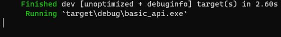
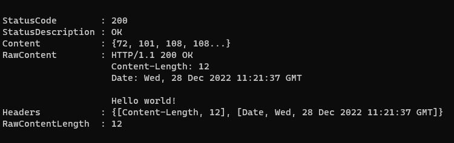

# Introduction

This project is simple implementation of API made in Rust with Actix Web. You can run the project on your local machine.

# Requirements to run app

You will need Rust installed on your computer. To do so you should visit [Rust Website](https://doc.rust-lang.org/book/ch01-01-installation.html)

# How to run app

1. Download repo from Github to one of your chosen folder.
2. Run Terminal and select your folder with downloaded app.
3. Write `cargo run` in your terminal and wait for compilation process. 
You should receive something like this: 

4. Now you can start making requests to API

# Example of request to API

1. To run simple request open second new terminal and write: `curl 127.0.0.1:8080`
You should receive something like this:

